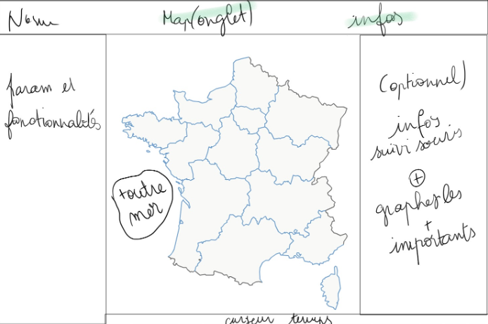

# Spécifications de l’IHM

Ebauche de la fenêtre correspondant aux CU1 et CU2
(ici visualisation des données réelles, pas la simulation)
	
## Tableau ICAR

Composants| Intentions | Action | Service appelé
--- | --- | --- | --- 
Map | charger map région | (onglet ) région sélectionné | getMapRegion <ul><li>`input : Date</li><li>output : - tableau région | nbCas</li></ul> 
Map | charger map département | (onglet ) département sélectionné |getMapDept <ul><li>`input : Date</li><li>output : - tableau département | nbCas</li></ul> 
Map | avoir des informations sur la région | click région | getInfosRégion <ul><li>`input : Date, région</li><li> output : cas confirmés, nb décès, nb hospitalisations, nb guéris, nb réanimés</li></ul> ouverture du panneau 2
Map | avoir des informations sur le département | click département | getInfosDept <ul><li>`input : Date, département</li><li> output : cas confirmés, nb décès, nb hospitalisations, nb guéris, nb réanimés</li></ul> ouverture du panneau 2
Données du jour France | avoir les données du jour sur la france | onglet données (panneau 1) | getInfosFrance  <ul><li>`input : Date</li><li> output : cas confirmés, nb décès, nb hospitalisations, nb guéris, nb réanimés</li></ul> 
Historique France | avoir l’historique de l'épidémie en France | onglet données | getHistoriqueFrance <ul><li>`input : Date</li><li> output tableau : cas confirmés  nb décès nb hospitalisations nb guéris nb réanimés</li></ul>
Historique Région |avoir l’historique de l'épidémie dans la région | onglet données | getHistoriqueRegion <ul><li>`input : Date, région</li><li> output tableau : cas confirmés  nb décès nb hospitalisations nb guéris nb réanimés</li></ul>
Historique Département | avoir l’historique de l'épidémie dans le département | onglet données | getHistoriqueDept <ul><li>`input : Date, département</li><li> output tableau : cas confirmés  nb décès nb hospitalisations nb guéris nb réanimés</li></ul>
Simulation| charger map région | (onglet ) région sélectionné | getMapRegion <ul><li>`input : Date</li><li>output : - tableau région | nbCas</li></ul> 
Simulation| charger map département | (onglet ) département sélectionné |getMapDept <ul><li>`input : Date</li><li>output : - tableau département | nbCas</li></ul> 
Simulation| avoir des informations sur la région | click région | getInfosRégion <ul><li>`input : Date, région</li><li> output : cas confirmés, nb décès, nb hospitalisations, nb guéris, nb réanimés</li></ul> ouverture du panneau 2
Simulation| avoir des informations sur le département | click département | getInfosDept <ul><li>`input : Date, département</li><li> output : cas confirmés, nb décès, nb hospitalisations, nb guéris, nb réanimés</li></ul> ouverture du panneau 2